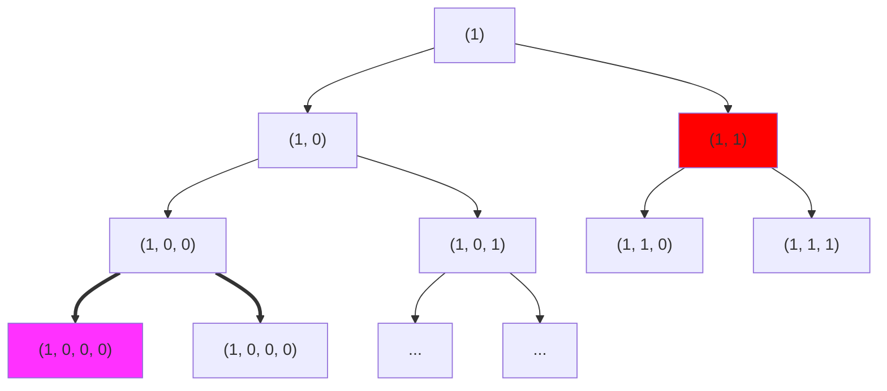

# 理解 Sum-Check
感谢: Tianyu, Charles, 0xhhh

本文假设读者对 SNARK 具有一定的认知

文中我们有两个可爱的小人 Paul(Prover) 和 Vivian(Verifier)

## 引言: SumCheck 的重要性

Todo

## SumCheck 保障了什么的正确性?

Paul 承诺它进行了某种 **计算** 后得到了一个值 $H$, 
这时他希望说服 Vivian 这个 $H$ 确实是通过执行此 **计算** 得出的结果, 
而不是随便编造的数值, 
并且 Vivian 不需要重新算一遍来进行验证 (注意这里是外包计算的场景, 本文暂不讨论零知识)

这个结果 $H$ 是由下述计算过程得出的:

$$
H:=\sum_{b_1\in\{0,1\}}\sum_{b_2\in\{0,1\}}\ldots\sum_{b_v\in\{0,1\}}g(b_1,\ldots,b_v) \tag{0}
$$

为了简便我们把 H 重新写成如下的形式

$$
\begin{align*}
H :=& \sum_{ b_1, b_2, b_3, \ldots, b_v \in\{0,1\}^{v} } g(b_1, b_2, b_3, \ldots, b_v)
\end{align*}
$$

其中 $g(u_1, u_2, \ldots, u_v)$ 是定义在 $\mathbb{F}_p$ 上的多元一次多项式,
$b_1,b_2, b_3,\ldots,b_v\in\{0,1\}^v$是一个 *v-dimensional Boolean hypercube* 上所有顶点的集合,
函数 $g$ 以这个 hypercube 的每一个顶点作为输入进行计算后得到了 $2^v$ 个结果, 
$H$ 是这些结果的总和

> Let $\mathbb{F}$ be any finite field, and let $f : {0, 1}^v → \mathbb{F}$ be any function mapping the v-dimensional Boolean hypercube to $\mathbb{F}$. A v-variate polynomial $g$ over $\mathbb{F}$ is said to be an extension of $f$ if $g$ agrees with $f$ at all Boolean-valued inputs, i.e., $g(x) = f (x)$ for all $x ∈ {0, 1}^v$. Here, the domain of the v-variate polynomial $g$ over $\mathbb{F}$ is $\mathbb{F}^v$, and 0 and 1 are respectively associated with the additive and multiplicative identity elements of $\mathbb{F}$.
> 
> Hypercube: 超立方体 
>
> Boolean hypercube: 

小结: SumCheck 保障的是 Verifer 可以相信 Prover 确实执行了上面的计算过程(亦即得到了真实的计算结果 H)

如果你对协议的细节感兴趣的话, 那么我会在下面的章节中解释这个公式和 SumCheck 的流程

## A Trivial Way
在给出 sumcheck 的具体流程之前, 我们先一起进行如下的计算 ( 不要慌, 下面的计算不复杂, 只是为了解释的清晰一点导致占用的行比较多 )
对算式 $(1)$ , 
我们把 $\sum_{b_1, b_2, b_3, \ldots, b_v\in\{0,1\}^v}$ 按照 $b_1, b_2, \ldots, b_v$ 拆开

我们带入 $\textcolor{red}{b_1 = 0, 1}$ 可以得到第一层拆解

$$
\begin{align*}
H :=& \sum_{ b_1, b_2, b_3, \ldots, b_v \in\{0,1\}^{\textcolor{red}{v}}   } g(\textcolor{red}{b_1}, b_2, b_3, \ldots, b_v) \\
=&    \sum_{ b_2, b_3,      \ldots, b_v \in\{0,1\}^{\textcolor{red}{v-1}} } g(\textcolor{red}{0},   b_2, b_3, \ldots, b_v) \tag{1,0} \\
+&    \sum_{ b_2, b_3,      \ldots, b_v \in\{0,1\}^{\textcolor{red}{v-1}} } g(\textcolor{red}{1},   b_2, b_3, \ldots, b_v) \tag{1,1} \\
\end{align*}
$$

接下来 我们带入 $\textcolor{Orange}{b_2 = 0, 1}$ 可以得到第二层拆解

$$
\begin{align*}
(1,0) :=& \sum_{ b_2, b_3, \ldots, b_v \in\{0,1\}^{\textcolor{red}{v-1}} } g(\textcolor{red}{0}, \textcolor{Orange}{b_2}, b_3,\ldots, b_v) \\
=&        \sum_{      b_3, \ldots, b_v \in\{0,1\}^{\textcolor{Orange}{v-2}} } g(\textcolor{red}{0}, \textcolor{Orange}{0},   b_3,\ldots, b_v) \tag{1,0,0} \\
+&        \sum_{      b_3, \ldots, b_v \in\{0,1\}^{\textcolor{Orange}{v-2}} } g(\textcolor{red}{0}, \textcolor{Orange}{1},   b_3,\ldots, b_v) \tag{1,0,1} \\
\\
(1,1) :=& \sum_{ b_2, b_3, \ldots, b_v \in\{0,1\}^{\textcolor{red}{v-1}} } g(\textcolor{red}{1}, \textcolor{Orange}{b_2}, b_3,\ldots, b_v) \\
=&        \sum_{      b_3, \ldots, b_v \in\{0,1\}^{\textcolor{Orange}{v-2}} } g(\textcolor{red}{1}, \textcolor{Orange}{0},   b_3,\ldots, b_v) \tag{1,1,0} \\
+&        \sum_{      b_3, \ldots, b_v \in\{0,1\}^{\textcolor{Orange}{v-2}} } g(\textcolor{red}{1}, \textcolor{Orange}{1},   b_3,\ldots, b_v) \tag{1,1,1}
\end{align*}
$$

第三次我们拆解, 带入 $\textcolor{magenta}{b_3 = 0, 1}$ 
对上次拆解得到的 $(1,0,0), (1,0,1), (1,1,0), (1,1,1)$ 继续拆解, 我们仅拆解一个, 其余不再赘述.

$$
\begin{align*}
(1,0, 0) :=& \sum_{ b_3, \ldots, b_v \in\{0,1\}^{\textcolor{Orange}{v-2}} } g(\textcolor{red}{0}, \textcolor{Orange}{0}, \textcolor{magenta}{b_3},\ldots, b_v) \\
=&           \sum_{ b_4, \ldots, b_v \in\{0,1\}^{\textcolor{magenta}{v-3}} } g(\textcolor{red}{0}, \textcolor{Orange}{0}, \textcolor{magenta}{0},  \ldots, b_v) \\
+&           \sum_{ b_4, \ldots, b_v \in\{0,1\}^{\textcolor{magenta}{v-3}} } g(\textcolor{red}{0}, \textcolor{Orange}{0}, \textcolor{magenta}{1},\ldots,b_v)
\end{align*}
$$

以此类推, 我们可以找到一个二叉树的结构, 

我们可以从这个二叉树中观察到几个事实
1. 父节点的值等于其子节点的值的和(比如上图中标记粗线的部份);
2. 这个树的层数是 v 层, 对应的这个树的叶子节点是 $2^v$ 个；
3. 一个节点所在层数越接近底部, 其叶子节点越少, 这个节点所需的计算量越小.

从根节点出发, 第 i 轮计算中, Trivial 的方式是
1. 从 Paul 处索要 $(1, 0, \ldots), \ldots$  总计 $2^i$ 个值
2. Vivian 把上面的点两两相加, 验证上一轮拿到的 $2^{i-1}$ 值的正确性 
3. Vivian 保留收到的 $2^i$ 个值 并在下一轮对它们进行验证

如果 Vivian 选择不自己计算全部的值，而是直接相信 Paul 提供的结果.
那边获取那么二叉树中红色的节点需要的信任成本要大于品红色的节点.
- 因为红色节点是 $2^{v-1}$ 个叶子节点的和, 信任红色节点就意味着信任 Paul 是 $2^{v-1}$ 个点上诚实地执行了正确的计算
- 品红节点是 $2^{v-3}$ 个叶子节点的和, 需要信任的点更少了

个人理解, 所谓验证, 就是要在在每一轮交互过程中逐渐减少 V 对 P 的信任成本

从这个二叉树的根节点出发, 每向下一层, 单个节点信任成本减半, 但该层需要验证的节点对比上一层数量翻倍.

那我们有没有什么方式, 每向下一层, 能让信任成本减半, 但是避免了被验证节点翻倍呢? 答案是有的.

## SumCheck 协议是如何工作的

我们看一下我们的第一层拆解, 其中$(1, 0), (1, 1)$ 其实是同一个多项式

$$
g_1(\textcolor{red}{X_1})= \sum_{b_2, b_3, \ldots, b_v \in\{0,1\}^{\textcolor{red}{v-1}} } g(\textcolor{red}{X_1}, b_2, b_3, \ldots, b_v)
$$

在 $X_1 = 0, X_1 = 1$ 上计算的结果.
受这一点启发, 我们把原本从 Paul 处索要 $(1, 0), (1, 1)$ 更改为从 Paul 索要多项式 $g_1(X_1)$, Paul 可以通过 $(1, 0), (1, 1)$ 插值出 $g_1(X_1)$.

即：

$$
\begin{align*}
g_1(X_1) =& \sum_{b_2, b_3, \ldots, b_v \in\{0,1\}^{\textcolor{red}{v-1}} } g(X_1, b_2, b_3,...,b_v) \\
=& \sum_{b_2, b_3, \ldots, b_v \in\{0,1\}^{\textcolor{red}{v-1}} } g(0, b_2, b_3,...,b_v) \cdot(1-X_1) + \sum_{b_2, b_3, \ldots, b_v \in\{0,1\}^{\textcolor{red}{v-1}} }g(1, b_2, b_3,...,b_v) \cdot X_1
\end{align*}
$$

然后 Vivian 自己计算 $g_1(0), g_1(1)$, 并验证 H 是否等于 $g_1(0) + g_1(1)$,
至此我们在下一层计算时, 就不再需要验证从 Pual 要来的两个值, 而是验证从 Pual 要来的一个多项式是否正确

那么如何验证一个多项式呢? 可以采用随机挑战的方式来实现.
1. Vivian 通过生成一个随机值 $r_1$ 发送给 Pual
2. Pual 计算 $g_1(r_1)$ 并返还给 Vivial
3. Vivian 在下一轮中验证 $g_1(r_1)$ 的正确性

现在我们有了 $g_1(r_1)$ 我们进行于上一节类似的拆解来看一下这个值,
带入 $\textcolor{Orange}{b_2 = 0, 1}$ 

$$
\begin{align*}
g_1(\textcolor{red}{r_1}) =& \sum_{b_2, b_3, \ldots, b_v \in\{0,1\}^{\textcolor{red}{v-1}} } g(\textcolor{red}{r_1}, \textcolor{Orange}{b_2}, b_3, \ldots, b_v) \\
=& \sum_{b_3, \ldots, b_v \in\{0,1\}^{\textcolor{Orange}{v-2}} } g(\textcolor{red}{r_1}, \textcolor{Orange}{0}, b_3, \ldots, b_v) \tag{r1, 0} \\
+& \sum_{b_3, \ldots, b_v \in\{0,1\}^{\textcolor{Orange}{v-2}} } g(\textcolor{red}{r_1}, \textcolor{Orange}{1}, b_3, \ldots, b_v) \tag{r1, 1}
\end{align*}
$$

如果我们把 $g_1(r_1)$ 视作一个"*新的 H*" ,
我们会发现这个新的 H 依赖了 2^(v-1) 个节点的正确性, 
并且 $(r1, 0), (r1, 1)$ 其实也是一个多项式

$$
g_2(\textcolor{Orange}{X_2})= \sum_{b_3, \ldots, b_v \in\{0,1\}^{\textcolor{Orange}{v-2}} } g(\textcolor{red}{r_1}, \textcolor{Orange}{X_2}, b_3, \ldots, b_v)
$$

在 $X_2 = 0, X_2 = 1$ 上计算的结果

类似的, Vivian 在验证了"*新的 H*" ( 即 $g_1(r_1)$ ) 是否等于 $g_2(0) + g_2(1)$ 之后,
再次发送一个新的随机值 $r_2$ 来进行下一轮新的验证,
同样的, 我们有

$$
\begin{align*}
g_2(\textcolor{Orange}{r_2}) =&  g_3(\textcolor{magenta}{0}) + g_3(\textcolor{magenta}{1})\\
g_3(\textcolor{magenta}{X_3}) :=& \sum_{b_4, \ldots, b_v \in\{0,1\}^{\textcolor{magenta}{v-3}} } g(\textcolor{red}{r_1}, \textcolor{Orange}{r_2}, \textcolor{magenta}{X_3}, \ldots, b_v) \\
\end{align*}
$$

这时我们发现, 只要不断的递归下去,
Vivian 能够在每一轮的交互中使信任成本减半, 
并且下一轮需要验证的节点没有翻倍.

通过上面的例子 我们定义函数: 

$$
\begin{align*}
g_{\textcolor{magenta}{i}}({\textcolor{magenta}{X_i}}) := \sum_{b_{\textcolor{magenta}{i+1}}, \ldots, b_v \in\{0,1\}^{\textcolor{magenta}{v-i}} } g(\textcolor{Orange}{r_1}, \textcolor{Orange}{r_2}, \ldots, \textcolor{Orange}{r_{i-1}}, \textcolor{magenta}{X_i}, \ldots, b_v)
\end{align*}
$$

从根节点出发, 第 i 轮计算中, 我们可以这样设计
1. 每一轮验证开始 Vivian 向 Paul索要 $g_i(X)$, 
2. Vivian 自己计算 $g_i(0), g_i(1)$, 并验证 $g_i(r_{i-1})$ 是否等于 $g_i(0) + g_i(1)$,
3. Vivian 生成一个随机值 $r_i$ 发送给 Paul
4. Vivian 自行计算 $g_i(r_{i})$ 并在下一轮交互中对该值进行验证

而这就是 SumCheck 的核心流程, 对照的看
|  Trivial   | Sumcheck  |
|  ----  | ----  |
| 从Paul处索要 $(1, 0, \ldots), \ldots$  总计 $2^i$ 个值 |  Vivian 向 Paul 索要 $g_i(X)$ |
| Vivian 把上面的点两两相加, 验证上一轮拿到的$2^{i-1}$值的正确性 | Vivian 自己计算 $g_i(0), g_i(1)$, 并验证 $g_i(r_{i-1})$ 是否等于 $g_i(0) + g_i(1)$ |
||Vivian 生成一个随机值 $r_i$ 发送给 Paul |
| Vivian 保留收到的 $2^i$ 个值 并在下一轮对它们进行验证 | Vivian 自行计算 $g_i(r_{i})$ 并在下一轮交互中对该值进行验证|
